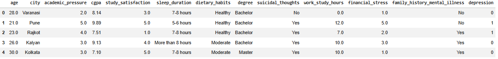
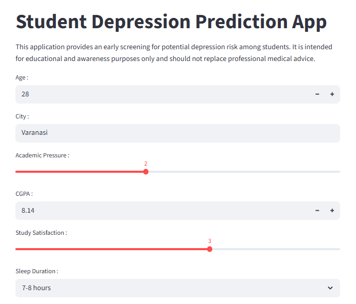
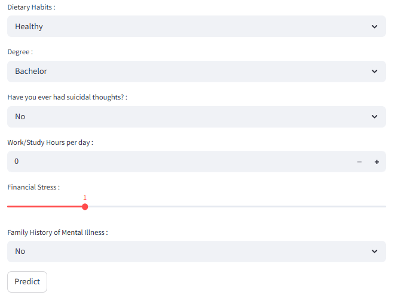
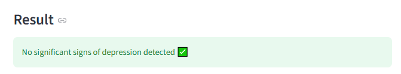
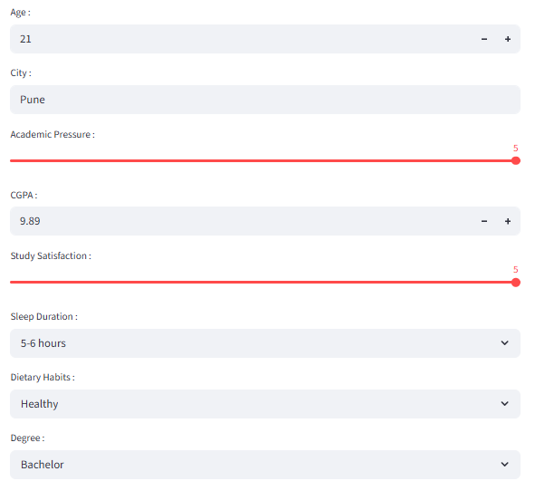
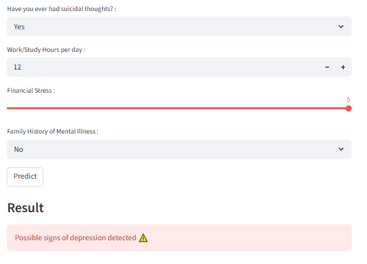
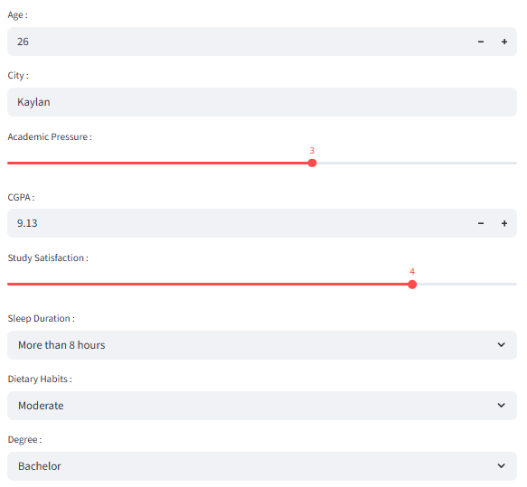
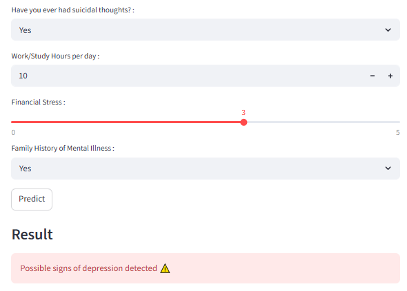

# student-depression-prediction
An end-to-end machine learning project for early student depression risk prediction with XGBoost, threshold tuning, and Streamlit deployment.

---
**Disclaimer**:
This application is intended for educational and early screening purposes only.

It is NOT a medical diagnosis tool and should not replace professional mental health assessment, diagnosis, or treatment.

If you or someone you know is experiencing mental health difficulties, please seek support from a qualified healthcare professional.

## 1. Overview
This project is a machine learning-based web application that predicts the likelihood of depression risk among students based on lifestyle, academic, and personal factors.

**The application is built using:**
- Python 3.12
- Scikit-learn
- Streamlit

The goal of this project is to provide an early screening tool for awareness and educational purposes.

**Features**
- Interactive Streamlit web application
- Instant depression risk prediction
- Probability-based prediction using a custom classification threshold
- End-to-end Scikit-learn preprocessing pipeline
  
## 2. Dataset
The dataset used in this project was obtained from Kaggle:

- Student Depression Dataset by Shodolamu Opeyemi
- Source: [https://www.kaggle.com/...](https://www.kaggle.com/datasets/hopesb/student-depression-dataset)

The dataset contains student-related information such as:
- Age
- Academic pressure
- CGPA
- Sleep duration
- Dietary habits
- Financial stress
- Work/study hours
- Suicidal thoughts
- Family history of mental illness
- Degree and city information

## 3. Exploratory Data Analysis (EDA)

Exploratory data analysis was conducted to understand feature distributions, relationships, and potential patterns in the dataset.

The analysis included:
- Distribution plots and boxplots
- Correlation heatmaps for numerical features
- Cramér’s V analysis for categorical feature relationships
- Chi-square tests for categorical associations
- Missing value and class distribution analysis

## 4. Data Preprocessing

The preprocessing pipeline was implemented using Scikit-learn `Pipeline` and `ColumnTransformer`.

Techniques used include:
- Median imputation for numerical features
- Standard scaling
- One-hot encoding for categorical variables
- Ordinal encoding for ordered categorical variables
- Binary encoding for yes/no features

The preprocessing pipeline and trained model were exported using `joblib`.

## 5. Machine Learning Models
Multiple classification algorithms were evaluated for this project:
- Logistic Regression (baseline model)
- Random Forest Classifier
- XG Boost
  
Each model was trained using the same preprocessing pipeline for fair comparison.

## 6. Model Optimization
Hyperparameter tuning was conducted using `GridSearchCV` to identify the best-performing model configuration.

Different model configurations were evaluated and compared using validation metrics such as:
- Accuracy
- Precision
- Recall
- F1-score
- Learning Curve

## 7. Model Performance
The final model was chosen based on:
- Recall (priority metric for reducing false negatives)
- F1-score
- ROC-AUC

Due to the focus on early mental health screening, recall was prioritized over precision.
A `Precision–Recall curve` was used to analyze the tradeoff between precision and recall and to select an optimal classification threshold.

## 8. Technologies Used
- Python
- Pandas
- NumPy
- Scikit-learn
- Streamlit
- Joblib
- Matplotlib
- Seaborn

--- 

## 9. How to Use the Application
1. Start the application using Streamlit (https://student-depression-prediction-app.streamlit.app/)
2. Enter the required student information in the form
3. Click the **Predict** button
4. The system will generate an instant prediction of depression risk based on the trained machine learning model

## 10. Output
After clicking the Predict button, the application displays:

- A final prediction result:
  - No significant signs of depression detected
  - Possible signs of depression detected

**This image shows a sample test data instance obtained from the train-test split in the notebook, used to demonstrate and explain the model’s output.**
 
 
### A) Case 1
**This image shows a sample input instance from the dataset labeled as depression = 0 (no depression)**

  

  

  

### B) Case 2 : 
**This image shows a sample input instance from the dataset labeled as depression = 1 (depression)**

  

  

### C) Case 3 (Special Case): 
**This image shows a sample instance labeled as 0 (no depression) in the dataset, but the model predicts 1 (possible depression) after threshold adjustment in Streamlit.**

  

  

**This reflects the intentional trade-off to prioritize recall, where false negatives are reduced even if it results in more false positives for early risk detection. This ensures that students who may have a risk of depression are not missed during screening.**

